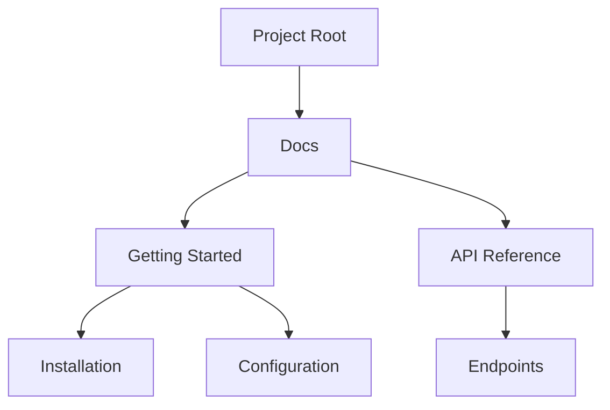

## Overview

Understand the core concepts of dhananjay yadav Documentation to organize your projects effectively. You manage documents through a clear hierarchy, track changes with version control, and follow streamlined workflows. These foundations help you build scalable documentation spaces.

<Columns cols={3}>
  <Card title="Document Hierarchy" icon="file-tree" href="#document-hierarchy">
    Organize content in nested structures for easy navigation.
  </Card>
  <Card title="Version Control" icon="git-branch" href="#version-control">
    Track changes and collaborate without conflicts.
  </Card>
  <Card title="Project Workflows" icon="workflow" href="#project-workflows">
    Follow steps to create, publish, and maintain docs.
  </Card>
</Columns>

## Document Hierarchy

Documents form a tree-like structure starting from the project root. You create pages, subpages, and folders to reflect your content logic. This hierarchy appears in the sidebar navigation.



Use frontmatter in MDX files to define metadata:

<CodeGroup tabs="MDX,YAML">
  ```mdx
---
title: Installation Guide
description: Step-by-step setup instructions
tags: ["guide", "beginner"]
---
## Quick Start
Install via npm.
  ```
  ```yaml
title: API Endpoint
description: Handles user authentication
version: "1.0"
path: "/auth/login"
  ```
</CodeGroup>

<Callout kind="tip">
  Nest pages up to five levels deep for optimal performance. Use slugs like `concepts/hierarchy` for SEO-friendly URLs.
</Callout>

## Version Control Basics

Version control lets you branch, merge, and revert changes. Integrate with Git providers to automate publishes. Create branches for features like `docs-v2.0`.

<Tabs>
  <Tab title="Branching" icon="git-branch">
    Branch from main for new docs:

    ```bash
    git checkout -b feature/new-guide
    git push origin feature/new-guide
    ```
  </Tab>
  <Tab title="Merging" icon="git-merge">
    Merge after review:

    ```bash
    git checkout main
    git merge feature/new-guide
    git push origin main
    ```
  </Tab>
</Tabs>

| Action | Command | Purpose |
|--------|---------|---------|
| Create branch | `git checkout -b <name>` | Isolate changes |
| Merge | `git merge <branch>` | Integrate updates |
| Revert | `git revert <commit>` | Undo safely |

## Project Workflows

Follow these steps to manage your documentation projects.

<Steps>
  <Step title="Create Project" icon="plus">
    Start a new space in the dashboard. Add your repository URL.
  </Step>
  <Step title="Structure Docs" icon="file-tree">
    Organize files in `/docs` folder. Use MDX for rich components.
  </Step>
  <Step title="Version & Publish" icon="upload-cloud">
    Tag releases like `v1.0.0`. Trigger builds on push.
  </Step>
  <Step title="Collaborate" icon="users">
    Invite team members. Assign reviewers for pull requests.
  </Step>
</Steps>

<Expandable title="Advanced Workflows" default-open="false">

For CI/CD integration:

```yaml
# .github/workflows/docs.yml
name: Deploy Docs
on: push
jobs:
  build:
    runs-on: ubuntu-latest
    steps:
      - uses: actions/checkout@v4
      - name: Build
        run: npm run build:docs
```

Customize previews for branches.

</Expandable>

<Callout kind="info">
Master these concepts to scale your documentation. Experiment in a test project first.
</Callout>