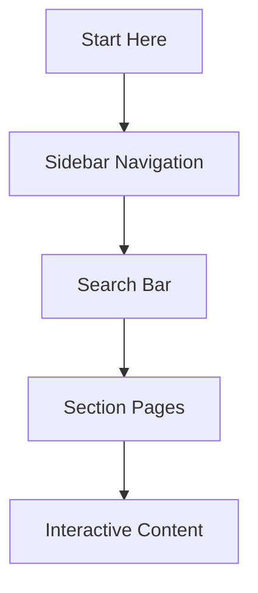

## Platform Overview

Welcome to Dhananjay Yadav Documentation, your centralized hub for organizing and managing all project documentation. You create structured spaces to house guides, APIs, changelogs, and tutorials. The platform supports MDX for rich, interactive content with components like tabs, steps, and cards to enhance readability.

This space serves as the default documentation area. You customize it with your brand color `#3B82F6` and tailor navigation to match project needs.

<Columns cols={3}>
  <Card title="Structured Organization" icon="layers" href="/docs/organization">
    Group content into sections and pages for easy navigation.
  </Card>
  <Card title="Interactive Components" icon="components" href="/docs/components">
    Use tabs, steps, and code examples to engage readers.
  </Card>
  <Card title="Version Control" icon="git-branch" href="/docs/versions">
    Track changes and maintain multiple documentation versions.
  </Card>
</Columns>

## Key Benefits

You gain efficiency with these core advantages:

- **Centralized Management**: Store all docs in one place, reducing fragmentation.
- **Rich Media Support**: Embed code, diagrams, and videos seamlessly.
- **Search and Navigation**: Built-in search finds content instantly.

<Callout kind="tip">
  Customize your sidebar navigation to reflect project structure for faster access.
</Callout>

<Tabs>
  <Tab title="For Developers" icon="code">
    Access API references and code samples directly.
    
    <CodeGroup tabs="JavaScript,Python">
      ```javascript
      // Fetch documentation metadata
      const docs = await fetch('https://api.example.com/docs');
      console.log(docs.title);
      ```
      ```python
      # Fetch documentation metadata
      import requests
      response = requests.get('https://api.example.com/docs')
      print(response.json()['title'])
      ```
    </CodeGroup>
  </Tab>
  <Tab title="For Teams" icon="users">
    Collaborate with real-time editing and version history.
  </Tab>
</Tabs>

## Getting Oriented

Follow these steps to familiarize yourself with the space:

<Steps>
  <Step title="Explore Navigation" icon="menu">
    Use the sidebar to browse sections like APIs, Guides, and Changelog.
  </Step>
  <Step title="Search Content" icon="search">
    Enter keywords in the top search bar to locate specific topics.
  </Step>
  <Step title="Customize Your View" icon="settings">
    Adjust theme, dark mode, and brand colors via space settings.
  </Step>
</Steps>



<ExpandableGroup>
  <Expandable title="Advanced Navigation Tips" default-open="false">
    Pin frequently used pages to the top of your sidebar. Use tags like `{["feature", "api"]}` for filtering content.
  </Expandable>
</ExpandableGroup>

<Callout kind="success">
  Start creating your first page today to experience the full power of Dhananjay Yadav Documentation.
</Callout>